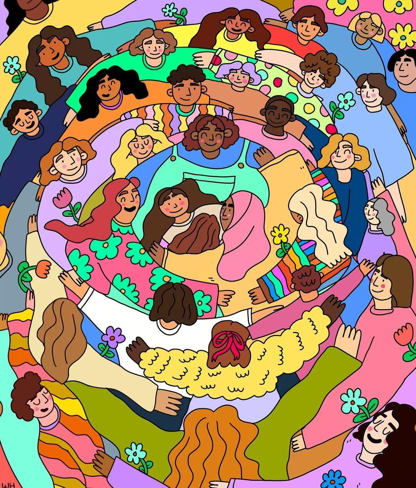

<picture>
  
</picture>

 

<!-- 社交链接徽章 -->

---

## 👋 Hi, I’m **Aaricis**

- 🔭 Working on **Humanizing AI Through Emotional Intelligence**  
- 🌱 Studying **Speech LLMs, Text-To-Speech, Speech-To-Text**  
- 💬 Ask me about **Python, PyTorch, Machine Learning**  
- 📫 Reach me at **Edith_Zhang@outlook.com**  
- 🌐 Website: [Personal Blog](https://aaricis.github.io/)  
- 🚀 Project: [AI情感陪伴应用 The Moment](https://github.com/Aaricis/the-moment)  
- 📃 Tutorials:  [Transformer From Scratch](https://github.com/Aaricis/Build-Transformer-From-Scratch), [SFT](https://github.com/Aaricis/Introduction-to-Generative-AI-2024-Spring/tree/main/LLM_SFT), [RLHF](https://github.com/Aaricis/Introduction-to-Generative-AI-2024-Spring/tree/main/RLHF), [Stable Diffusion SFT](https://github.com/Aaricis/Introduction-to-Generative-AI-2024-Spring/tree/main/Stable_Diffusion_SFT)

---

## 🚀 Currently Working On

---

## 📝 Latest Blog Posts
<!-- BLOG-POST-LIST:START -->
- [李宏毅-ML2022-HW15-Meta Learning](https://aaricis.github.io/posts/Homework-15-Meta-Learning/)
- [李宏毅-ML2022-HW14-Lifelong Learning](https://aaricis.github.io/posts/Homework-14-Lifelong-Learning/)
- [李宏毅-ML2022-HW13-Network Compression](https://aaricis.github.io/posts/Homework-13-Network-Compression/)
- [李宏毅-ML2022-HW12-Reinforcement Learning](https://aaricis.github.io/posts/Homework-12-Reinforcement-Learning/)
- [Build Transformer Form Scratch](https://aaricis.github.io/posts/Build-Transformer-Form-Scratch/)
<!-- BLOG-POST-LIST:END -->

---

## 📊 GitHub Stats

  
  

---

## ⚡ Activity & Metrics

  
   
  

---
